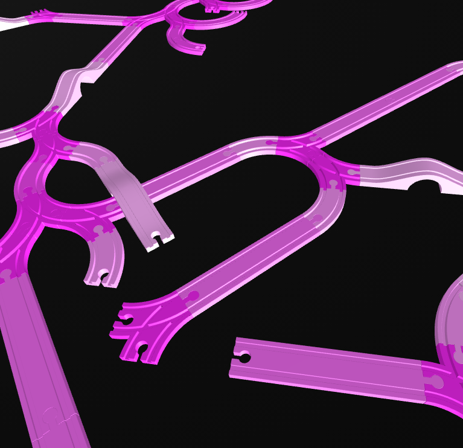
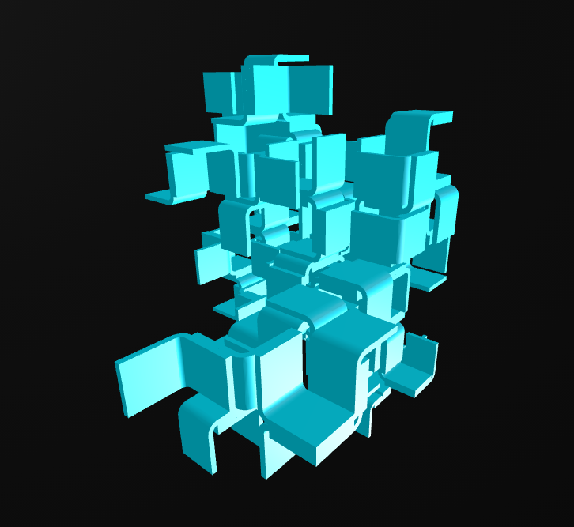
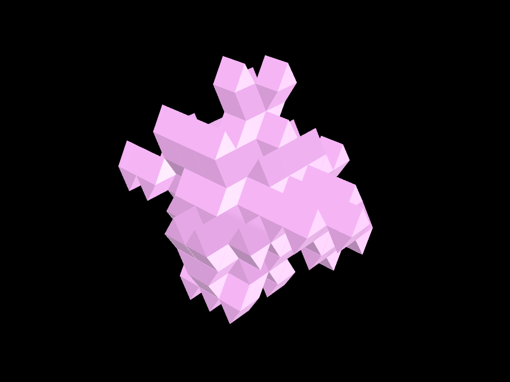
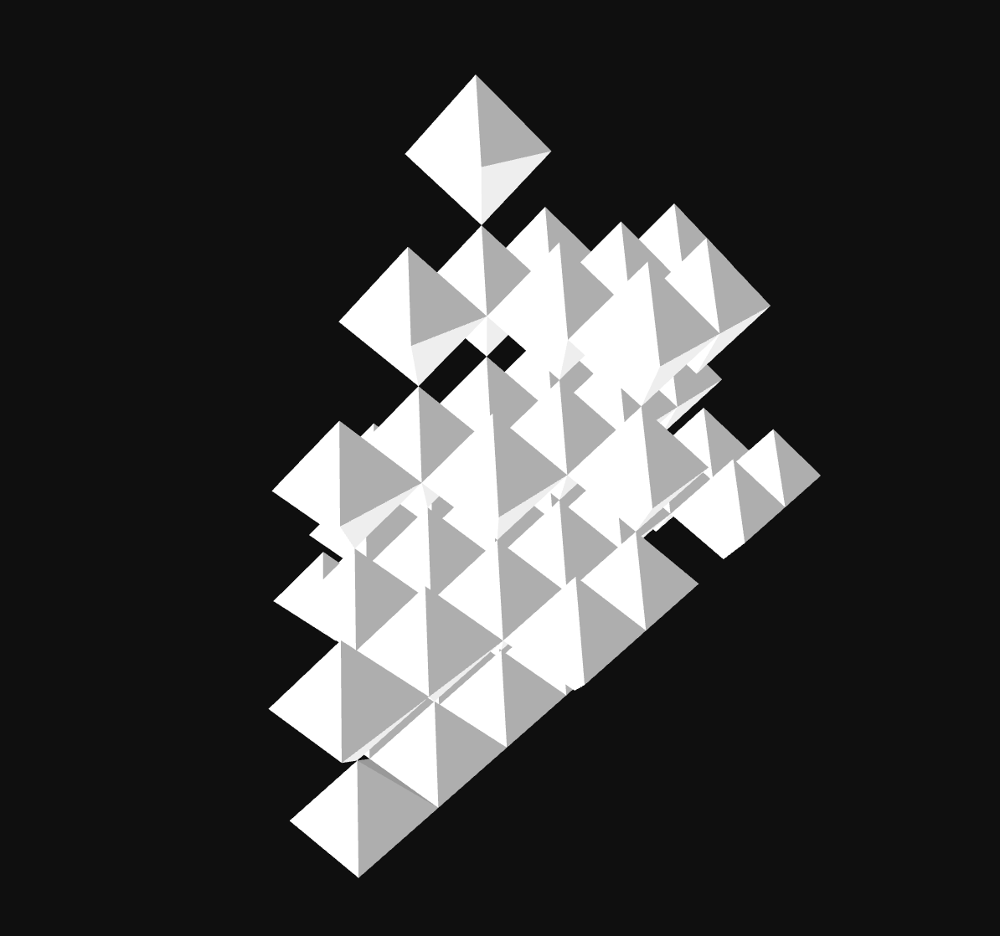
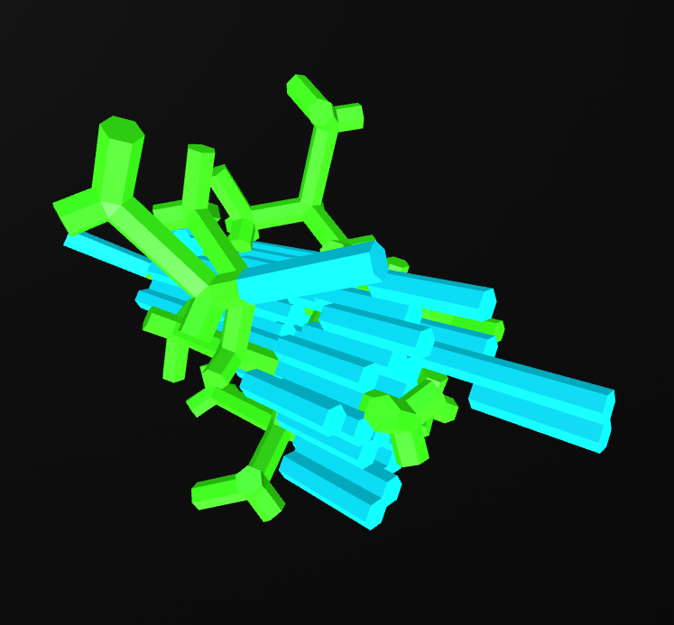

# Wasp-Atlas
Collection of reusable Aggregation systems for the Wasp Framework

## Available systems

<!-- AUTO-LIST:START -->

| Preview | System | Tags | Files |
|---|---|---|---|
|  | **Brio Rails** — Brio rails aggregation with chamfered colliders. Created this example during the development of WaspJS. by Roger Winkler | construction toys, wood | [aggregation](systems/brio-chamfer/aggregation.json) · [meta](systems/brio-chamfer/meta.json) |
|  | **Corner Shape** — Corner aggregation example. by Andrea Rossi | examples, simple | [aggregation](systems/corner-shape/aggregation.json) · [meta](systems/corner-shape/meta.json) |
|  | **gyrobifastigium** — [object Object] |  | [aggregation](systems/gyrobifastigium/aggregation.json) · [meta](systems/gyrobifastigium/meta.json) |
|  | **Octahedra** — Default example by Roger Winkler | geometry, testing | [aggregation](systems/octahedra/aggregation.json) · [meta](systems/octahedra/meta.json) |
|  | **Stacked Sticks** — Stick aggregation example from WASP basic examples. by Andrea Rossi | examples, simple | [aggregation](systems/stacked-sticks/aggregation.json) · [meta](systems/stacked-sticks/meta.json) |

<!-- AUTO-LIST:END -->
