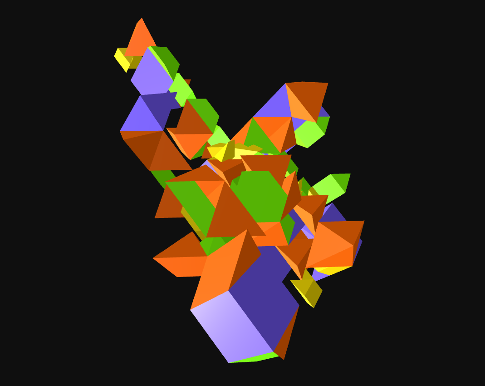

# Sommerville Tetrahedra No. 1 - Multiple Elements

## Description

Volumetric space-filling aggregation derived from the Sommerville Tetrahedra No.01. Developed as part of the PEEK Inventorics Project (FWF AR 730-G)

## Information

| Field | Value |
|---|---|
| Slug | `sommerville-tetrahedra-no-1-multiple-elements` |
| Author | [Lukas Allner, Daniela Krönerth, Naomi Neururer, Andrea Rossi](https://inventorics.com/) |
| License | CC-BY-SA-4.0 |
| Tags | `inventorics` `space filling` `solids` |
| Software | v0.7... |
| Units | Centimeters |
| Parts | 4 |
| Rules | 212 |

## Files

- [aggregation.json](aggregation.json)
- [meta.json](meta.json)

---

This README was generated automatically from `meta.json`.
